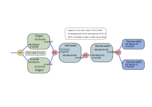

# Virtuele DIY Linux routers!
Dit is een vingeroefening in Vagrant om een setje Linux routers op te spinnen en te kijken of hiermee de functionaliteit van bijvoorbeeld de NSX Edge is te benaderen. Ook zou zoiets gebruikt kunnen worden waar anders Vyatta o.i.d. toegepast wordt.

Waarom deze? Voordeel van een DIY router is de vrijheid in maatwerk en daarmee flexibiliteit van de oplossing. Nadeel is het volledige gebrek aan support en daarmee ook het eigenhandig uitvoeren van het onderhoud.

## Installatie
Wat heb je nodig om los te gaan met deze spullen?
* Installeer Vagrant
* Installeer Virtualbox
* git clone https://code.ogdsoftware.nl/bas.dusee/DIY-Linux-routers.git
* cd *DIY-Linux-routers-repo-dir*
* Vagrant up
* Vagrant ssh Edge1 (of Edge2 of Introuter, of Darkrouter, of Darkweb01/02)

## Design van het Vagrant netwerkje
Hier een netwerktekening:

Edge1 en Edge2 zijn twee redundante Edge routers en hangen aan het Internet (in dit geval is het Internet een Host-Only netwerk met de Virtualbox host). Het idee is dat deze Active/Passive of Active/Active werken en elkaars werk kunnen overnemen.

Daarachter ligt een "intern" subnet (noem het een DMZ oid) waaraan een enkele interne router hangt (Introuter). Deze interne router ontsluit een nog dieper gelegen subnetje wat in eerste instantie niet bekend is bij de beide Edge routers (routing protocol nodig dus..). Op dat diepere netwerkje zitten twee webservers (ik voel een load balancing aankomen...).

Normaal gaat de routing naar internet door alle routers heen naar buiten, maar dankzij Vagrant en Virtualbox heeft elke router een eigen Virtualbox NAT adapter. De NAT adapters hebben op elke box exact hetzelfde IP adres (10.0.2.15) en altijd de default route erheen geforceerd. Dit is lastig eruit te slopen. Ik heb dit netwerk maar "mgmt" genoemd om het voor een management subnet te laten doorgaan, dat is in het echt vaak ook zo. Alleen de default gateway door het management VLAN is nogal funky. Wel is het makkelijk met deployen, Introuter kan zo simpel pakketten installeren. In een real life scenario wil je dit anders hebben natuurlijk!

## Ontwerp van de DIY box
De boxen zelf zijn op basis van Debian 9 (Ubuntu vertrouw ik niet 100%, die installeert nog wel eens meuk, en CentOS ben ik niet zo mee bekend). Ik gebruik de Bentobox ervan omdat daar de Virtualbox guest drivers al in zitten (nodig voor mounten host directory). In een prod environment is het handig zelf Debian te installeren en deployen vanaf de officiële distro repositories, uiteraard.

### Configuratie management boxen
Configuratie gebeurd via Salt vanuit Vagrant. Ik gebruik Salt omdat ik het ken. Dit kan net zo makkelijk met de Chef of Ansible plugin natuurlijk. Er gebeuren geen spannende dingen met Salt, alleen pakketjes installeren en config files parsen en plaatsen. Eenieder kan de files lezen en snappen wat er gebeurd en makkelijk dit nabouwen in je eigen favo config tool.

### software keuze
De boxen krijgen (een deel van) de onderstaande software voor de volgende functies:
* **BIRD** - voor de Routing protocollen. Ik gebruik OSPF. Quagga kon ook, maar BIRD is de industrie standaard tegenwoordig. BIRD heeft meer toeters en bellen, zoals multiple OSPF instances, wat Quagga niet kan.
* **iptables-persistent** - Voor firewalling en NAT doe ik gewoon iptables. Dit geeft de meeste flexibiliteit. Wel kan het wat complex overkomen en is het iets foutgevoeliger. Alternatieven kunnen zijn: firewalld of ufw. Beiden ben ik niet zo'n fan van, maar deze zijn prima te gebruiken in dit scenario.
* **OpenVPN** - Remote access SSL inbellen. site2site kan ook, maar dat doe ik liever met IPSEC.
* **StrongSwan** - site to site ipsec VPN oplossing. Intersteunt IKEv1 en IKEv2. Remote Access kan ook. Zelfs met Windows 10 native tools. Ga ik wel mee testen.
* **Failover** - Systeem om de Edges elkaar laten overnemen. Pacemaker gebruik ik daar nu voor, maar dit kan ook met Keelalived of kaal met Heartbeat (minder handig, maar kan).
