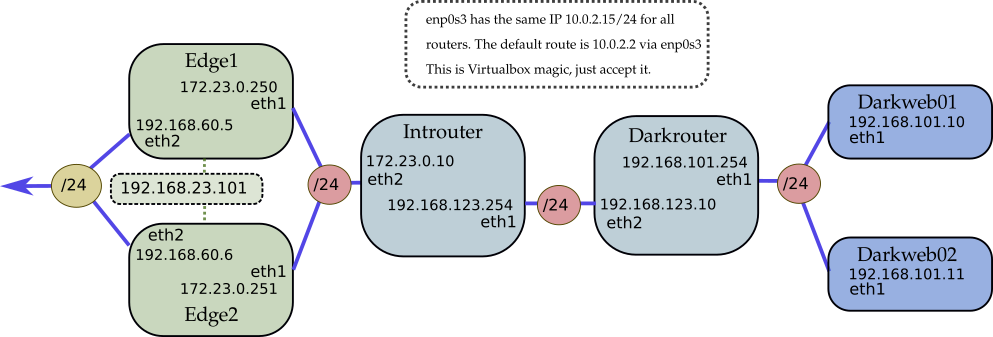

# Virtual DIY Linux routers!
This is a small excercise to configure Linux servers as (internet facing) routers.
It's ment as a virtual solution and as a comparison to the functionality to solutions as Vyatta and NSX Edge routers.
The whole thing is created in Vagrant, with SaltStack as provisioning language. It uses Virtualbox as a virtual platform.
Testing is only done on a Windows machine due to lack of other equipment. YMMV on other platforms, although it shouldn't be hard to get this running under Linux or some form of BSD.

But Why?!? Because the benefits of a DIY router is flexibility in the solution and freedom to create whatever solution suits your situation. 
The downside is the complete lack of (commercial) support and the complete responsibility for any form of maintenance.

## Installation
What do you need to go wild with this project?
* Install Vagrant
* Install Virtualbox
* git clone https://github.com/basdusee/vagrant-linux-routers.git
* cd *vagrant-Linux-routers-repo-dir*
* Vagrant up
* Vagrant ssh Edge1 (or Edge2 or Introuter, or Darkrouter, or Darkweb01/02)

## Network design of the Vagrant Linux router thingy
For your amusement, a network diagram:

Edge1 and Edge2 are two redundant Edge routers which are connected to the  Internet (The "Internet" in this case is a Host-Only network connected to the Virtualbox host). The general idea is to configure these routers Active/Passive or Active/Active. They should be able to replace each other when one of them fail.

Right behind this router there's an "intern" subnet (call it some sort of DMZ, which is not the correct term) to which a single internal router is connected (the Introuter). This router discloses a much more internal subnet which should be anounced to the Edge routers via a routing protocol. There are two webservers connected to this internal subnet. That sounds like a job for a load balancer...

Virtualbox is a little weird considering networking, especially when you use Vagrant. It's very difficult to not use the "NAT" network connector on each router, because this is the interface Vagrant provisions over. So there is a funky default route problem, which points to the "NAT" interface by default. All routers have 10.0.2.15 as an IP on the "NAT" interface, and the default route allways points to 10.0.2.2. I'm still figuring out a good way to solve this.

## Design of the DIY routers
The Vagrant routers are all made of "bento" boxes and I use the Debian 9 variety right now. It's really advisable to do a manual (or automated) install of Debian yourself in a real production environment. I do not really know what's in the Bento boxes exactly. The reason for choosing Bento, is the already installed guest drivers, which are needed for provisioning from Vagrant.

### Configuration of the routers
Vagrant configures the machines automatically, using it's builtin SaltStack provisioner. I choose Salt because I'm familiair to it. You can use "vagrant provision" to re-provision already created machines.
You can just as easily implement this using Ansible or Chef (both supported in Vagrant). There are no special tricks involved in the provisioning which is only accessible to Salt.

### Choice of installed software
The routers are configured with (parts of) the following software:
* **BIRD** - for Routing protocols. I use OSPF mainly here. Quagga was also an option in this environment, but BIRD is the industry standard at the moment. BIRD has more bells and whistles, like multiple OSPF instances, which Quagga is unable to do.
* **iptables-persistent** - I use/choose plain iptables for firewalling and NAT. This gives me the most flexibility although it looks the most complex and is the most error prone due to typing errors. Considered alternatives were: firewalld or ufw. I dislike both, but they are very usefull in this scenario.
* **OpenVPN** - For remote access SSL VPN. site2site is also possible with OpenVPN, but IPSEC is more suited for this.
* **StrongSwan** - site to site ipsec VPN solution. Supports IKEv1 and IKEv2. Remote Access VPN is also possible, but cumbersome. 
* **Failover** - This example uses keepalived to manage a virtual IP address with failover capabilities. 
